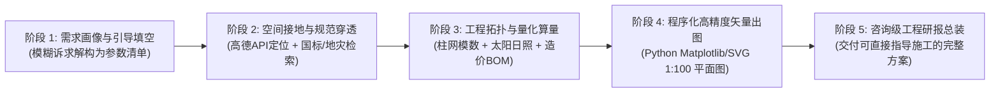

# 通用深度调研与工程方案研报技能 (Deep Research Dossier Skill)

## 技能定位与核心价值
本技能专为复杂现实工程、乡村规划、建筑选型及产业投资等通用深度调研场景设计。
区别于普通文本问答，本技能强调：
1. **拒绝虚构推演**：必须依托物理事实、气象数据、地质构造及国标法定红线。
2. **地图空间接地 (Spatial Grounding)**：深度整合高德/百度 Web API 与天基遥感 DEM，自动反演真实高程剖面、道路物流及周边供应链。
3. **程序化精确出图**：利用 Python 矢量制图引擎，直接输出符合工程规范的 1:100 比例建筑平面图、动线分析图与立面示意图。

---

## 五步标准工程作业流水线 (SOP)

### 1. 阶段 1: 需求画像与引导式参数填空
* **触发机制**：当用户输入粗粒度或模糊工程需求时，自动解构领域参数知识树。
* **输出物**：输出符合桌面端交互式组件解析规则的 `### 📋 ...需求确认与参数清单`，引导用户一键点选确认核心变量。

### 2. 阶段 2: 地图空间接地与法规穿透 (Spatial Grounding & Code Ingestion)
* **执行脚本**：调用 `scripts/geo_grounding.py`。
* **核心动作**：
  * 地址经纬度解析（精确至自然村/组）。
  * 地块 1500×1000 级高清正射底图下载。
  * 施工重型货车进场路径与道路等级分析（距离、爬坡、狭管）。
  * 15km 范围内商混搅拌站与建材供应链 POI 探测。
  * 国标（GB 50009 荷载、GB 18306 抗震）与地质灾害隐患点穿透。

### 3. 阶段 3: 工程量化模型与参数计算 (Quantitative Modeling)
* **建筑模数与柱网规划**：按经济受力开间（如 3.9m~4.5m）分解轴网。
* **天文日照几何反演**：
  * 计算冬至日与夏至日正午太阳高度角 $h$。
  * 确定遮阳挑檐宽度与南向受光开间。
* **工料与造价基准估算**：输出钢筋含量、混凝土方量及单方造价区间。

### 4. 阶段 4: 程序化图纸装配 (Programmatic Blueprinting)
* **出图规范**：使用 Matplotlib 或 SVG 绘制，确保线型规范（粗实线为承重墙/柱、细实线为隔墙、虚线为轴线）。
* **标注要求**：标明开间/进深轴线尺寸、房间名称、净面积、门窗开启弧线、标高（±0.000）。

### 5. 阶段 5: 咨询级结构化研报总装 (Dossier Assembly)
* 整合环境档案、遥感底图、矢量工程图纸、结构与机电（MEP）技术交底及工程量清单（BOM），输出完整交付研报。
